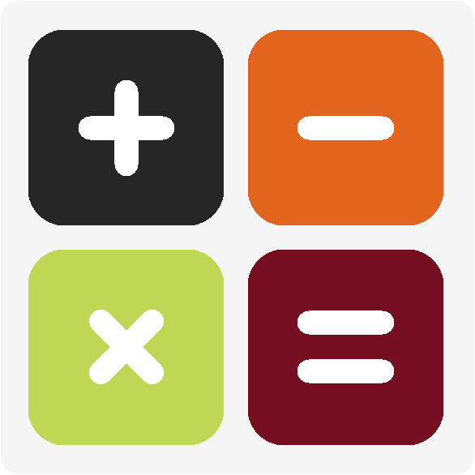

  

    <h1 align="center">Calculator</h1>

    <em><code>Laboratory Activity for Advance Object Oriented Programming (AOOP)</code></em>

	
	
	

## Sample Output

    
    
    
    
    
    
    
    	

<a href="https://youtu.be/_WDYciv4Z4E">Watch Video Demo HERE</a>

## Requirements

## Requirements
- Visual Studio 2022
- .NET Desktop Development

## Running the application
1. Open the Calculator.sln in Visual Studio
2. Run and build the application in "Release" mode
